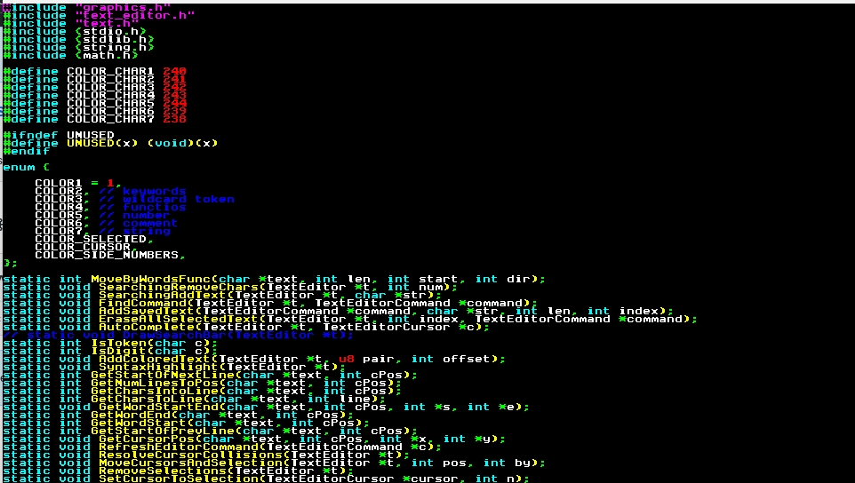
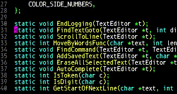
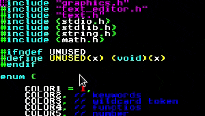
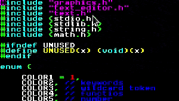
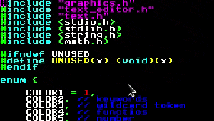
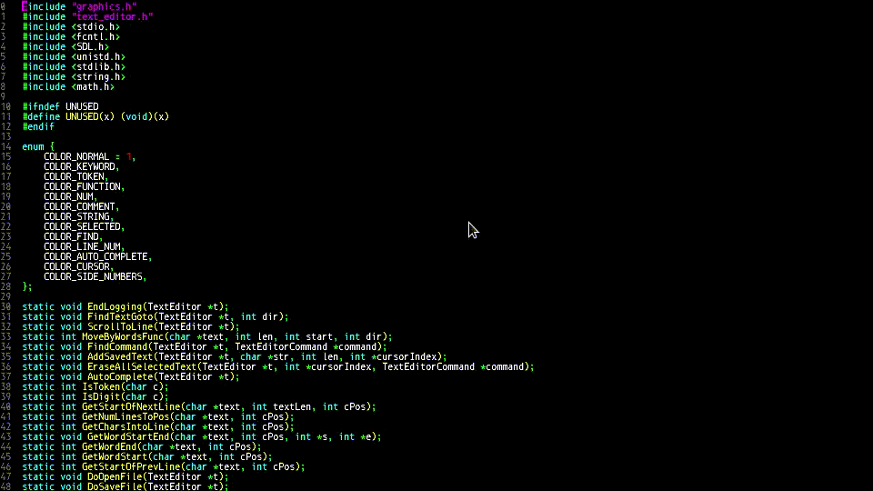

 
    <b>SelectNextWord</b> Find/Replace, CTRL+D In sublime text ||| <b>AddCursorCommand</b> Up/Down 
      
    <b>MoveLines</b> Up/Down ||| <b>MoveByWords</b> Left/Right <b>MoveByChars</b> Left/Right/Up/Down 
       
    <b>ExpandSelectionWords</b> Left/Right ||| <b>IndentLine</b> Left/Right 
     
    <b>Undo Redo Cut Copy Paste</b>  ||| <b>AutoComplete</b> 
      
    
    
    

 

<b>TODO</b>: 
files save open etc 
config files 
windows/tabs 
make libthoth for text editor embed for opengl games 
 
 
<b>COMMANDS</b>: 
ctrl+- (zoom out) 
ctrl+= (zoom in) 
ctrl+q (quit) 
escape (closes find/goto/console, removes extra cursors/selections) 
ctrl+b (compile (runs "make")) 
ctrl+y (redo) 
ctrl+z (undo) 
ctrl+x (cut) 
ctrl+c (copy) 
ctrl+v (paste) 
arrow keys (movement) 
ctrl+h (move left) ctrl+l (move right) ctrl+j (move up) ctrl+k (move down) 
shift+arrow up/down (scroll screen up/down) 
ctrl+alt+arrow right/left (expand selection by words right/left) 
ctrl+alt+[ (indent backward)  
ctrl+alt+] (indent forward)  
ctrl+alt+h (move by words left) ctrl+alt+l (move by words right) 
ctrl+shift+l (expand selection by a line) 
ctrl+shift+k (delete line) 
ctrl+arrow up (add cursor up) 
ctrl+arrow down (add cursor down) 
ctrl+d (select word under cursor if no selection. continued pressing selects the next occurance of word or selection) 
ctrl+g (goto line) 
ctrl+f (search) (enter to search forward, ctrl+enter to search backward) 
ctrl+m (move brackets) (moves cursor between the { }, ( ), [ ], of the current scope) (either to the end, or to the beginning if its at the end) 
ctrl+shift+j (select brackets) (selects everything between the brackets) 
ctrl+/ (toggle comment) (adds or removes // for the line to comment) (todo: mutli-line) 
ctrl+shift+arrow up/down (move line up/down) (moves the entire line the cursors on, or every line in the selection by a line) 
ctrl+o (open file) 
ctrl+w (save file) 

 
Deveoloped while bedridden after I got hit by a car on a moped. I'll be fully recovered soon.
